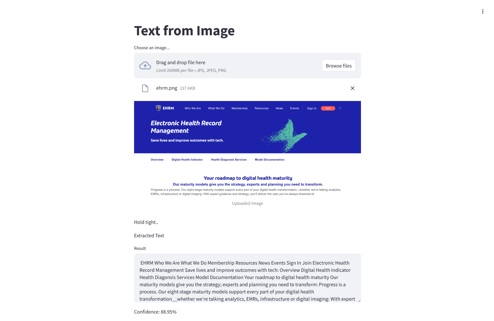

🚀Check out the configuration reference at https://huggingface.co/docs/hub/spaces-config-reference

🚀Huggingface Spaces : https://huggingface.co/spaces/prithivMLmods/OCR

🚀Docs for Space clone : 
    
    # Make sure you have git-lfs installed (https://git-lfs.com)
    git lfs install
    
    git clone https://huggingface.co/spaces/prithivMLmods/OCR
    
    # If you want to clone without large files - just their pointers
    
    GIT_LFS_SKIP_SMUDGE=1 git clone https://huggingface.co/spaces/prithivMLmods/OCR

##  ⛰️ The File Processing and OCR Outcome with Confidence :

## Requirements.txt [ PyPI ]
    streamlit 
    easyocr
## easyocr

    Ready-to-use OCR with 80+ supported languages and all popular writing scripts including: Latin, Chinese, Arabic, Devanagari, Cyrillic, etc.

.

.

.
